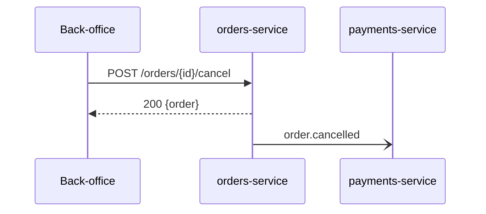

# Order cancellation — sequence

```mermaid
sequenceDiagram
    participant BO as Back-office
    participant API as orders-service
    participant PAY as payments-service
    BO->>API: POST /orders/{id}/cancel
    API-->>BO: 200 {order}
    API-)PAY: order.cancelled
```
