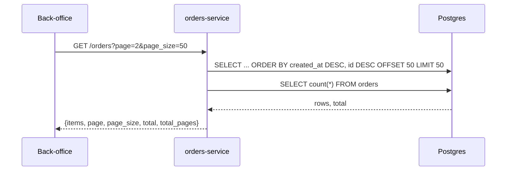

# Order listing — sequence

```mermaid
sequenceDiagram
    participant BO as Back-office
    participant API as orders-service
    participant DB as Postgres
    BO->>API: GET /orders?page=2&page_size=50
    API->>DB: SELECT ... ORDER BY created_at DESC, id DESC OFFSET 50 LIMIT 50
    API->>DB: SELECT count(*) FROM orders
    DB-->>API: rows, total
    API-->>BO: {items, page, page_size, total, total_pages}
```
