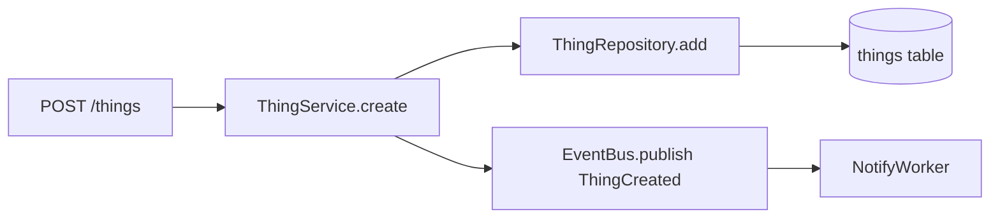
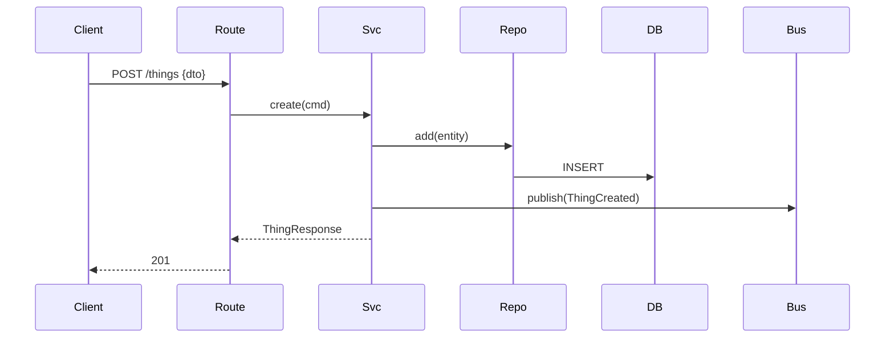

# graphify.md

> Skill: build mental graph of unfamiliar code before edit. Trigger: "explore", "understand", "map", "where does X flow", new bounded context, onboarding to module.

## Goal

Produce structured map: nodes (modules / classes / functions / tables), edges (calls / imports / data flow), boundaries (layers / contexts). Output = Mermaid diagram + short narrative. No edits.

## When use

- New repo, new module, or unfamiliar bounded context
- Before refactor touching >3 files
- Tracing bug across layers
- Reviewing MR that spans many files
- Answering "how does X work" with high confidence

Skip for: single-file fixes, trivial edits, areas already mapped in `docs/`.

## Steps

1. **Anchor.** Pick entry point: route, CLI cmd, job, public function. Note file:line.
1. **Outward sweep.** Follow imports + calls outward 1-2 hops. Track each hop: caller → callee + reason.
1. **Inward sweep.** `grep` for references to anchor. Who invokes it. Why.
1. **Data flow.** Identify DTOs / models / DB tables touched. Note schema crossings (DTO ↔ domain ↔ ORM).
1. **Side effects.** External calls, DB writes, queue publishes, log emits.
1. **Boundaries.** Tag each node by layer (route / service / repo / adapter / domain). Spot violations.
1. **Render.** Mermaid `flowchart` or `sequenceDiagram`. Save under `docs/diagrams/explore/<topic>.md` or paste inline.
1. **Narrative.** 5-10 bullets: entry, key collaborators, data shape transitions, surprises, open questions.

## Tools to use

- `Explore` subagent for broad search (multi-file, naming-convention spread)
- `grep` / `rg` for targeted symbol lookup
- Claude LSP for "find references" / "go to definition" when index warm
- `git log -p -- <file>` for intent behind non-obvious code
- `git blame` to find author for follow-up question

## Output templates

### Flowchart



### Sequence



### Narrative skeleton

```
Entry: <file:line>
Layer path: route → service → repo
Touched tables: <list>
Touched DTOs: <list>
External calls: <list>
Side effects: <list>
Open questions: <list>
Suspect smells: <list>
```

## Anti-patterns

- Mapping whole repo. Stay scoped to topic.
- Diagram for trivial 2-file path. Narrative suffice.
- Stop at imports - miss runtime dispatch (registries, plugin loaders, DI containers).
- Ignore tests - tests reveal intended contract fastest.
- Lie about uncertainty. Mark unknown edges with `?`.

## Checklist before edit

- [ ] Entry point identified
- [ ] Callers + callees mapped 1-2 hops
- [ ] Data shape transitions noted
- [ ] Side effects listed
- [ ] Layer violations flagged
- [ ] Open questions logged
- [ ] Diagram saved or pasted
